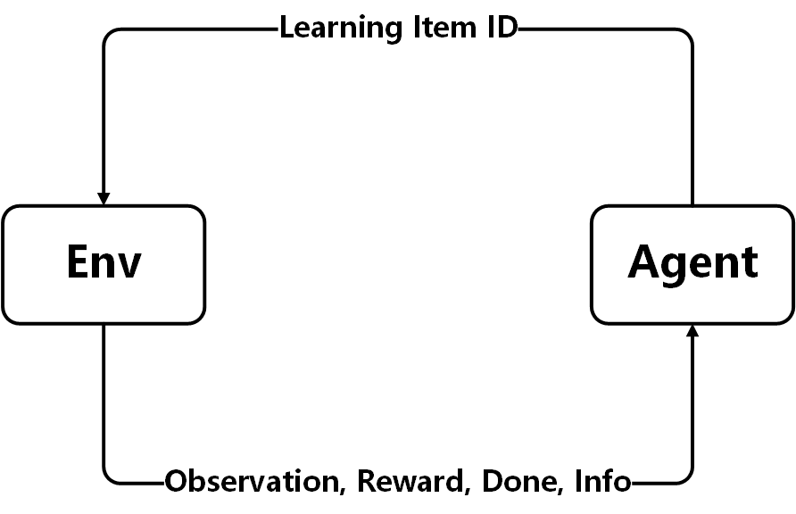
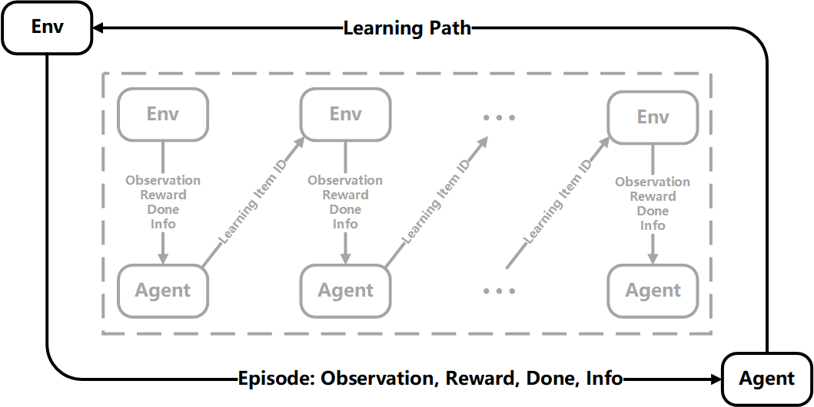
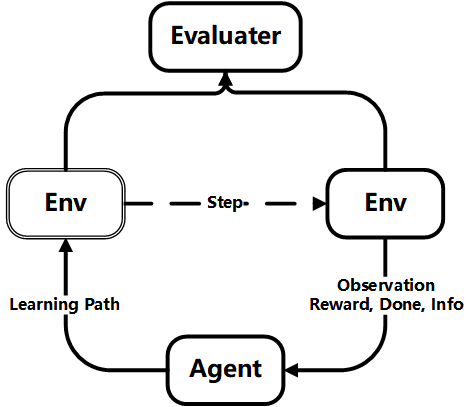
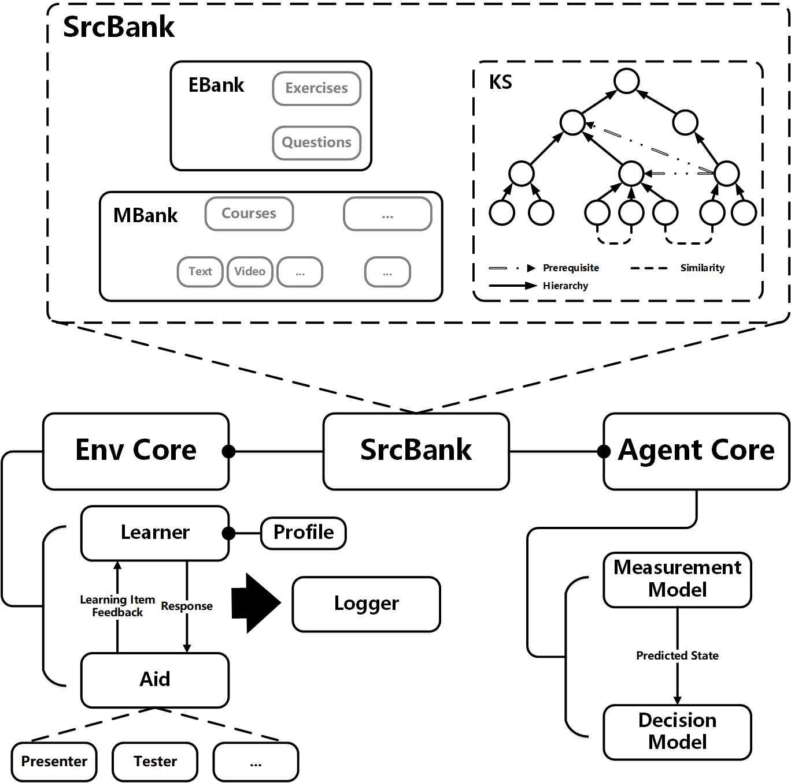
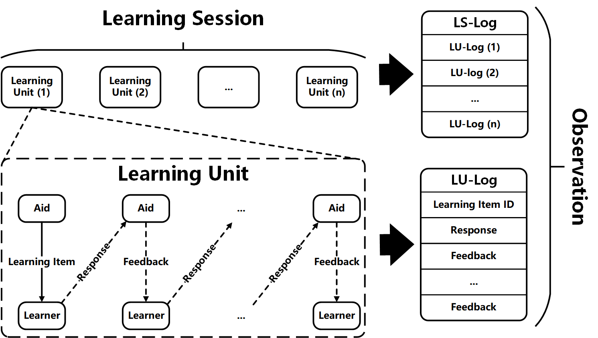
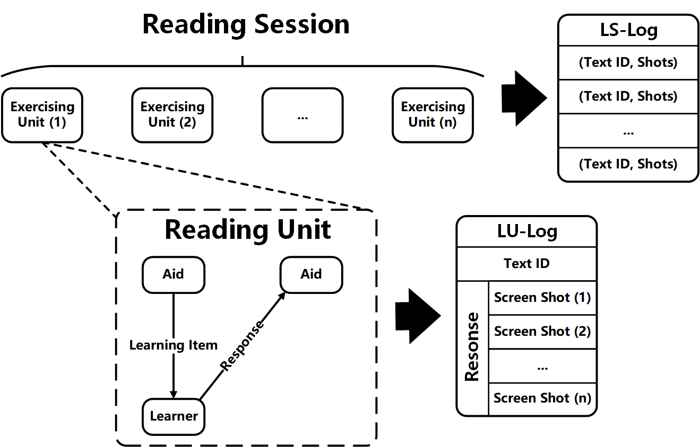
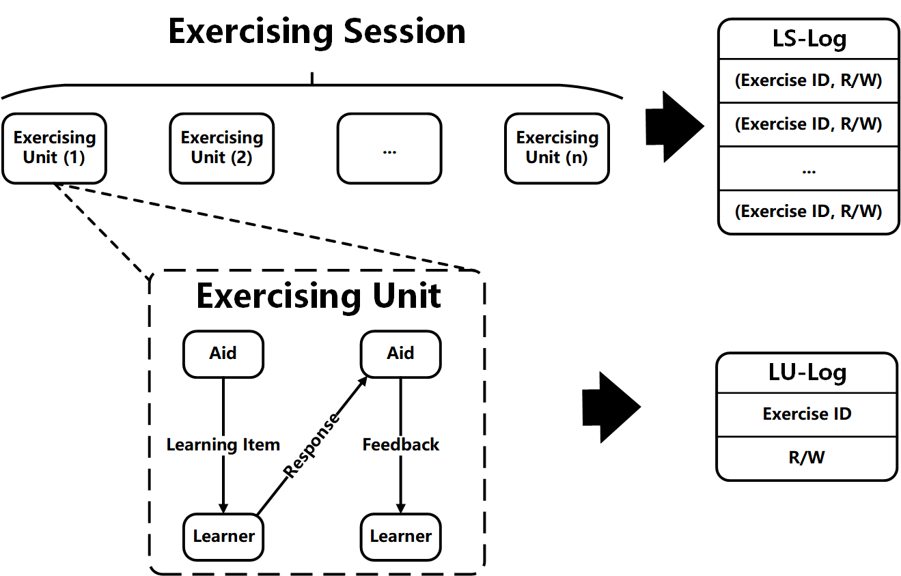
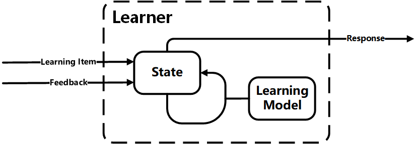

# Tutorial for building your own simulator from scratches

## Overview for EduSim

`Edusim` is developed on the basis of `gym`. First of all, let's take a look at the following figure, a general architecture based on MDP (Markov Decision Process) and `gym` API:



There exists two typical scenrio that educational environment may provide:

* point-wise recommendation
* sequence-wise recommendation (also known as learning path recommendation)

The architecture of the former one has been shown in the above figure, and the later one is shown in the following figure:



As will be readily seen, learning path recommendation can be thought as the sequential combinations of several point-wise recomendations. Without loss of generality, we introduce an optional evaluator into the MDP to provide supplemental metrics and the modified architecture is shown in the following figure:



Next, we will shown the details of `Env` and `Agent`, also with the definition of the interactions between them. The following figrue shows the main components of `Env` and `Agent`:



* `SrcBank` contains exercises (in some works, called questions), materials (e.g., textbooks, videos), KS (Knowledge Structure) and so on, which is shared accross `Env` and `Agent`.
* `Env Core` contains `Learner` and `Aid`.
* `Agent Core` contains `Measurement Model` and `Decision Model`

### Env Core

`Env Core` is used to model the interactions between `Learner` and `Aid`.  An `Aid` could be a tester, a presenter and so on. We first explains what is the interactions and then give some typical examples of the interactions, finally we will give an overview on the `Learner`:

First, we use the following figure to describe the `learning session` and `learning unit`:



A `learning session` describes a `learner` learns several learning materials or pratice exercises in a cerain period, which can be sequentially divided into learning units. In one learning unit, the learner is presented with a learning item (either learning material or an exercise), and he/she will learn the learning item via different ways, such as reading textbooks or answer the question in the exercise. The behaviour (reading or giving answer) is recorded as a response and will be paased to `Aid`. Different types of `Aid` will have different behaviours when it receives the response from the learner. For example, as shown in the following figure, a `presenter aid` applied to provide for reading session will not give any feedback to the `learner`,



while a `exercise aid` will give a feedback (e.g., whether the answer given by the learner is right).



The interactions (i.e. learning item, response and feedback) will be recored by a `logger` and will also be provided as the obsevation of the `Env` and passed to `Agent`.

Finally, we will show the architecture of the `Learner`:



We assume each learner has a knowledge state (i.e. `State`) and is modeled by a `learning model`. When a learner receives a learning item or a feedback, the learning model will determine how the state should be changed.

### Agent Core

In `Agent core`, `Measure Model` is optional and used to extract the learner's knowledge state from learning log (i.e., observation on `Env`). `Decision Model` is used to decide which of the learning items should be recommended in the next step.

### Notice

The framewoek is proposed to help users better organize the simulators while the components are not all required. For example, sometimes, the `SrcBank` (e.g., the exercise is represented by index) can be omitted.

Only the top api in `Env` is required to be implemented, the protocol of meta environment and variants are listed below:


### Advice for New Environment

We strongly recommend you write a simple demo script to show how a agent interacts with you new environment. The demo scripts of our provided environments are list below:


## The code sketklon of Edusim

In this part, we show skerklon of EduSim `Env`.

First of all, we present the class you should inheritate:

```python
class Env(gym.Env):
    metadata = {'render.modes': ['human']}

    def reset(self):
        raise NotImplementedError

    def render(self, mode='human'):
        pass

    def step(self, learning_item_id, *args, **kwargs):
        raise NotImplementedError

    def n_step(self, learning_path, *args, **kwargs):
        pass

    def begin_episode(self, *args, **kwargs):
        raise NotImplementedError

    def end_episode(self, *args, **kwargs):
        raise NotImplementedError

```

Once you implement all abstract methods (*although `render` and `n_step` are not required to be implemented, we still recommend you to override this two methods.*), you can use your new environment as follows (the code can be found in xxx):

```python
def train_eval(agent, env, max_steps: int = None, max_episode_num: int = None, n_step=False, train=False):
    episode = 0

    while True:
        if max_episode_num is not None and episode > max_episode_num:
            break

        try:
            learner_profile = env.begin_episode()
            agent.begin_episode(learner_profile)
            episode += 1
        except ValueError:  # pragma: no cover
            break

        # recommend and learn
        if n_step is True:
            assert max_steps is not None
            # generate a learning path
            learning_path = agent.n_step(max_steps)
            env.n_step(learning_path)
        else:
            # generate a learning path step by step
            for _ in range(max_steps):
                try:
                    learning_item = agent.step()
                except ValueError:  # pragma: no cover
                    break
                observation, reward, done, info = env.step(learning_item)
                agent.step(observation, reward, done, info)
                if done:
                    break

        # test the learner to see the learning effectiveness
        observation, reward, done, info = env.end_episode()
        agent.end_episode(observation, reward, done, info)

        if train is True:
            agent.tune()
```

*Certainly, you should implement `begin_episode`, `end_episode` , `step` and `tune` methods in your agent (`n_step` is not required but recommended). A toy agent can be found in the following part.*

### A toy simulator

In this part, we show how to build a toy simulator whose learning model is based on transition matrix.


The code has been included in EduSim package, you can conviently import it as follows:


Then, we use a random agent to test our environment and see how it goes.

```python

```

## Build a complex simulators from scratches

In this part, we will show how to construct a more complex environment which contains knowledge structure.

Assume we are going to build a environment where a `learner` sequatially learns learning items and the aid is of `exercise` type. We assume the `learning model` follows a transition matrix.

We need to prepare:

* `EBank`: provides exercises
* `Env Core`
  * defining `Learner`: define the `state` and the `learning model`
  * `Exerciser`: one kind of `Aid`, presents an exercise and feedback to the `learner` at each step.
  * `Logger`: record the log data
  * `Controller`: combine all other parts together

### EBank

For simplification, we suppose `EBank` accept `learning item ID` and return it. *Annotation: In real scenrio, the EBank may return the content of the exercise specified by the ID.*

```python
from EduSim import EBank as EB

class EBank(EB):
    """Exercise/Question Bank"""
    def __getitem__(self, item):
        """
        Examples
        --------
        >>> bank = EBank()
        >>> bank[123]
        123
        """
        return item
```

### Env Core

## Use the data-driven learning model in simulators

All learning models in mentioned above environments are rule-based models (or named human-defined). These models are quite suitable to examine the  whether the `agent` works as our expected. However, a shortcoming of this kind of simulators is that these simulators may be not consisitent with real data. Thus, we provide a way to plugin the data-driven learning model which is constructed from real-world data into a new environment.